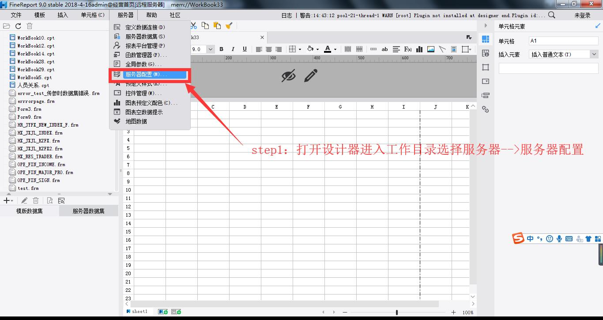
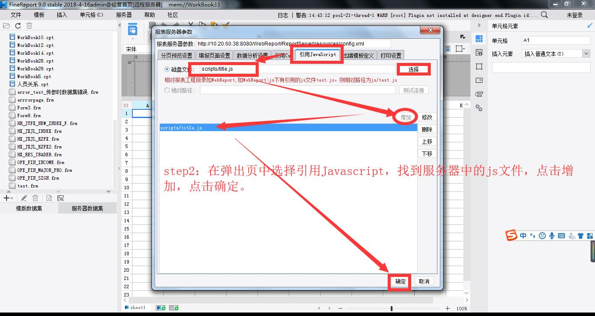
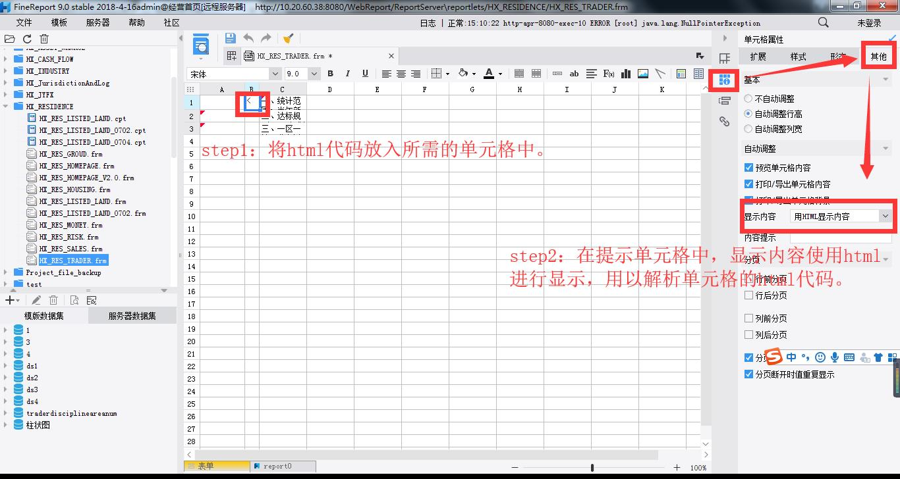
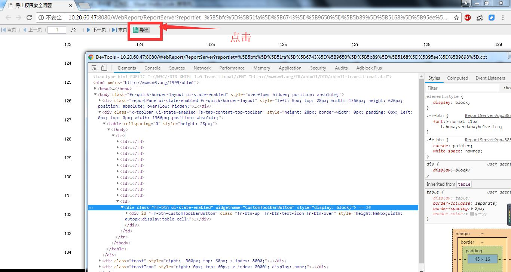
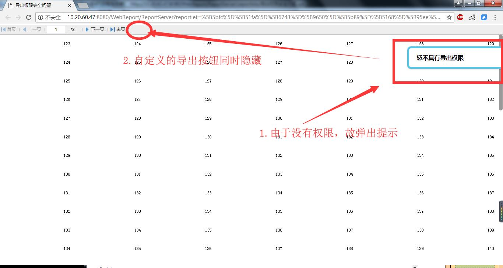

**本文档包含两个问题的技术解决方案**

|问题|简要说明|
|:--|:--|
|提示IE不兼容问题|在使用ie时，提示过大约7s~8s会自动消失|
|导出权限控制问题|无导出权限的人通过F12调用开发者工具修改页面内容可强制导出文档|


## 提示IE不兼容问题
#### 问题说明    
> IE浏览器中使用fr自带的提示在经过7s左右会自动消失，而chrome浏览器中无此问题。
#### 问题原因    
经查证，fr自带的提示是使用title属性，而title属性在ie中和在chrome中内核实现不同导致的差异。
#### 问题解决    
方案为通过重写title属性，在js中调用相关鼠标移入移出的事件来实现title属性所对应的功能。
#### 步骤    
1. 将`title.js`文件放入工程中，且在工程中引入该文件。

**title.js:**
```js
//获取当前的x坐标值  
function pageX(elem) {
    return elem.offsetParent ? (elem.offsetLeft + pageX(elem.offsetParent)) : elem.offsetLeft;
}
//获取当前的Y坐标值  
function pageY(elem) {
    return elem.offsetParent ? (elem.offsetTop + pageY(elem.offsetParent)) : elem.offsetTop;
}

function split_str(string, words_per_line) {
    var output_string = string.substring(0, 1);  //取出i=0时的字，避免for循环里换行时多次判断i是否为0   
    for (var i = 1; i < string.length; i++) {
        if (i % words_per_line == 0) {
            output_string += "<br/>";
        }
        output_string += string.substring(i, i + 1);
    }
    return output_string;
}


var title_value = '';
function title_show(pSpan) {
    var divObj = document.createElement("div");
    divObj.innerHTML = "<span id='title_show' style='position:absolute;display:none;background-color:#f0f0f0;z-index:999;opacity:1;font-size:12px;color:#999999;width:300px;padding:10px;border:1px solid #f5f5f5;border-radius:3px;line-height:18px'></span>";
    var first = document.body.firstChild;//得到页面的第一个元素 
    document.body.insertBefore(divObj, first);//在得到的第一个元素之前插入 
    var span = document.getElementById(pSpan);
    var div = document.getElementById("title_show");
    title_value = span.title;
    div.style.left = pageX(span) + 'px';
    div.style.top = pageY(span) + 20 + 'px';
    var words_per_line = 40;     //每行字数   
    var title = split_str(span.title, words_per_line);  //按每行25个字显示标题内容。      
    div.innerHTML = title;
    div.style.display = '';
    span.title = '';        //去掉原有title显示。  
}
function title_back(pSpan) {
    var span = document.getElementById(pSpan)
    var div = document.getElementById("title_show");
    span.title = title_value;
    div.style.display = "none";
}
```
**在工程中引入js文件如下图：**
1. **找到配置选项**    

2. **将js引入项目**


> 通过以上工作，我们已经将重写title的js方法放入服务器。    
> 接下来我们需要在单元格中进行使用。

**在报表单元格中调用重写的js方法**    
首先准备好要使用的提示文本所对应的html代码，此时该段代码已经调用到了我们放入服务器中的js内容    
```html
<span style="" id="span1" title ='一、统计范围：当年新摘牌项目，如果分批次开盘，取首批时间；<br>二、达标规则：5（摘牌-开盘），10（摘牌-现金流回正），同时满足；<br>三、一区一策：发布过一区一策操盘纪律的区域按照签批时间统计，未发布的全部按照23510统计。 ' onmouseover="title_show('span1');" onmouseout="title_back('span1');">   </span>
```
> **description:** 该段代码中显示的内容也是通过`img`标签进行引入图片的    

**将代码放入开发文件中的单元格中**


> 通过以上操作，我们完成了对页面提示title的重写    

**完成结果**


## 导出权限控制问题
#### 问题说明    
无导出权限的人通过F12调用开发者工具修改页面内容可强制导出文档
#### 问题原因
自带的导出功能是通过直接调用后台api实现导出，无法在中间做权限的判定，通过开发者工具将显示属性改为`block` 即可点击按钮，调用后台的api。
#### 问题解决
通过自定义按钮，去实现导出功能，通过权限，去判断是否导出，并给出不能导出的提示

自定义按钮js代码：
```js
fangwenlujing=FR.remoteEvaluate('=$reportName'); 
FR.Msg.toast('文件路径为:'+fangwenlujing);
var REPORT_URL = '/WebReport/ReportServer?reportlet='+fangwenlujing+'&format=excel'; 
if (export1=='true'){ 
window.location = (FR.cjkEncode(REPORT_URL));
}
else {
      contentPane.toolbar.getWidgetByName("CustomToolBarButton").setVisible(false);
      FR.Msg.toast('您不具有导出权限');	
	}
```

1. **找到配置选项**

2. **配置自定义按钮**

3. **实现导出的权限功能**


> 通过以上，我们已经完成了该部分功能的实现，需要注意的是，在表单加载起始，仍需要通过权限判断是否隐藏掉该按钮    

**加载起始中使用该段代码对没有权限的用户进行隐藏自定义按钮**
```js
contentPane.toolbar.getWidgetByName("CustomToolBarButton").setVisible(false);
```

**完成结果**
1. 修改导出源码前

2. 修改导出源码后

3. 点击显示出来的导出按钮
