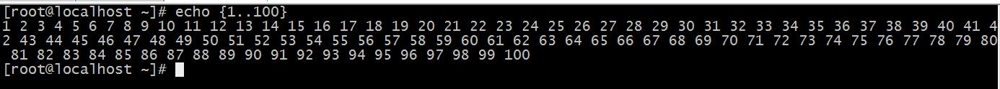

# linux 管道命令
在linux系统中，bash的功能非常的丰富与强大。

我们可以在bash中编程，可以循环、判断、写出结果到文件。

可以查询、更改所有的系统设置。

可以写批命令、定时计划。

甚至可以写游戏、玩游戏。

今天我们介绍的到的管道符是一个神奇的工具，它可以轻易地连接两个毫不相关的程序，把一个程序的结果交给另一个来处理，甚至，不停地交接处理。

第一个 我们先说用的非常多的一个用法。
```s
ps –ef |grep  python
```
Ps是linux中非常强大的进程查看工具，其中-e为显示所有进程，-f为全格式显示。

Grep是一个非常高效的查询工具，可以查询文本中带有某关键字的行。

这个命令的功能是，查询带有关键字 python 的进程。会一条一条列出。

单使用ps –ef会列出所有的进程，但是我们不需要看到所有的进程，我们只需要看我们想要的进程有没有存在于后台，所以用管道符，把所有的进程信息传给grep程序，帮我们搜索我们想要的进程信息。简直是神器，比如我们想要查看ssh服务是否开启，就可以运行ps –ef |grep ssh

下面有几道题，可以帮助我们很快地理解管道符的其他妙用。我们一起来做一下。

1. 将/etc/issue文件中的内容转换为大写后保存至/tmp/issue.out文件中
（Issue文件保存的是系统登录前的提示信息），其次是转换为大写，我们用转换命令tr来实现，tr [a-z] [A-Z]。最后用重定向保存到文件即可。

所以这道题的命令就是：
```s
cat /etc/issue |tr [a-z] [A-Z] > /tmp/issue.out
```


2. 将当前系统登录用户的信息转换为大写后保存至/tmp/who.out文件中

这道题同样，后面两个功能我们都知道了，获取当前用户的信息我们用，who命令。
```s
who | tr 'a-z' 'A-Z' > /tmp/who.out
```


3. 一个linux用户给root发邮件，要求邮件标题为 help ，邮件正文如下：
```
Hello, I am 用户名,The system version is here,please help me to check it ,thanks!

操作系统版本信息
```
这道题有几个点，用户名要进行替换，最后的操作系统版本信息也要替换，还有个回车符。我们用到一个命令，echo 就是把echo后面的信息输出出来。

如输出用户名echo $USER


输出操作系统版本信息uname –a


回车符就简单了 \n

我们组合一下如何写邮件内容：

```s
echo -e 'Hello, I am ' $USER ',The system version is here,please help me to check it,thanks!\n' `uname -a`
```


（红线上为命令，下为结果）

echo –e会对后面的\n进行解释，不然只会当成字符处理。字符要加单引号，避免出现问题。$USER不能加引号，\n必须在引号里。Uname –a是个命令，所以我们要加反引号。

接下来是发邮件的命令

格式是这样的mail –s “邮件标题” 收件人 内容

我们用管道符来传入内容进去
```s
echo -e 'Hello, I am '$USER ',The system version is here,please help me to check it,thanks!\n' `uname -a`|mail -s "help" root
```


4. 计算1+2+3+..+99+100的总和

这道题非常的经典。

看到这道题，你会想怎么去做？写个循环i++ j++？还是用公式（1+100）*n/2？

我们的bash可以非常巧妙的解决这个问题。

首先我们要知道linux 中有个计算器，叫bc，我们先来看看他的用法。
- 直接输入bc进入程序

- 扔给bc一条算式<br>


看到第二种用法，我们或许就意识到了，bc可以直接计算输入给他的字符串！

是不是很有趣？

那我们能不能拿到一个1+2+3+..+99+100的字符串呢？

我们知道echo {1..100}可以生成1 2 3 4 5 … 100的字符串，中间以空格隔开。




等等..用空格隔开？把空格换成加号不就行了么？我们来：
```s
Echo {1..100} |tr ' ' '+'
```
看我们拿到了什么？

再来
```
Echo {1..100} |tr ' ' '+'|bc 
```

