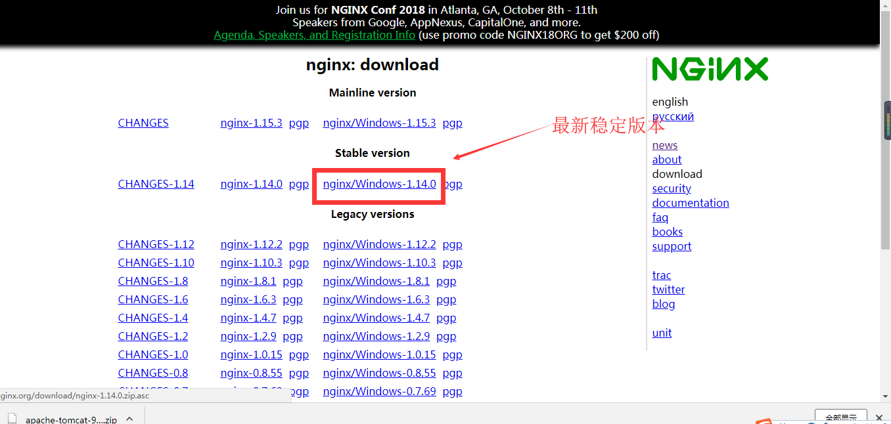

# nginx总结
- 什么是nginx？
Nginx (engine x) 是一款轻量级的Web 服务器 、反向代理服务器及电子邮件（IMAP/POP3）代理服务器。<br>
服务器集群：是指将很多服务器集中起来一起进行同一种服务，在客户端看来就是只有一个服务器。集群可以利用多个计算机进行并行计算从而获得很高的计算速度，也可以用多个计算机做备份，从而使得任何一个机器坏了整个系统还是能正常运行。<br>

均衡负载：对于集群来说，负载均衡意味着当方向代理服务nginx接受到用户发起的请求之后，会把请求按照配置的分配方式让各个服务器摊分任务，以此来减少服务器的压力，提高性能。

- 什么是反向代理？
反向代理（Reverse Proxy）方式是指以代理服务器来接受internet上的连接请求，然后将请求转发给内部网络上的服务器，并将从服务器上得到的结果返回给internet上请求连接的客户端，此时代理服务器对外就表现为一个反向代理服务器。

    > 关于反向代理，网上还有很多资料可以帮助理解。

- window与Linux上的安装
简单说一下window上的安装，Linux上安装方式百度后配置及命令一致

1. 首先下载地址：[nginx下载地址](http://nginx.org/en/download.html)
    > 选择下载稳定版本
    
2. 我们关于nginx的使用及配置主要就是两个文件夹，conf下是一些配置文件，logs中是一些日志文件。log文件夹中可以查看到nginx未成功启动的报错信息。*由于nginx与其他服务器不同，在命令窗口不会有相关提示*
3. 我们可以进入windows的命令窗口执行启动命令或者直接点击`nginx.exe`的可执行文件进行执行

## nginx的相关命令
- 我们启动nginx时，执行start nginx，就可以启动nginx，不放心吗？你可以到任务管理中查看一下。

- 当修改了配置文件后，需要重新reload，命令是 nginx -s reload，这个命令也很常用，当然还有其他命令，如下

- 有时候无法进行重启，进任务管理器杀掉该进程


命令|说明
:--|:--
nginx -s stop| 快速关闭Nginx，可能不保存相关信息，并迅速终止web服务。
nginx -s quit| 平稳关闭Nginx，保存相关信息，有安排的结束web服务。
nginx -s reopen| 重新打开日志文件。
nginx -c filename| 为 Nginx 指定一个配置文件，来代替缺省的。
nginx -t| 不运行，而仅仅测试配置文件。nginx 将检查配置文件的语法的正确性，并尝试打开配置文件中所引用到的文件。
nginx -v| 显示 nginx 的版本。
nginx -V| 显示 nginx 的版本，编译器版本和配置参数。

> 记得使用命令启动nginx或者重新reload的时候，可参考logs下的几个日志文件。


## 文件说明及实例
**conf/nginx.conf**
```conf
#运行的用户
#user  nobody;
 
#启动进程,通常设置成和cpu的数量相等
worker_processes  1;
 
#全局错误日志
error_log  D:/yh/nginx-1.10.2/logs/error.log;
error_log  D:/yh/nginx-1.10.2/logs/notice.log  notice;
error_log  D:/yh/nginx-1.10.2/logs/info.log  info;
 
#PID文件，记录当前启动的nginx的进程ID
pid       D:/yh/nginx-1.10.2/logs/nginx.pid;
 
#工作模式及连接数上限
events {
    worker_connections  1024; #单个后台worker process进程的最大并发链接数
}
 
#设定http服务器，利用它的反向代理功能提供负载均衡支持
http {
 
    #设定mime类型(邮件支持类型),类型由mime.types文件定义
    include       D:/yh/nginx-1.10.2/conf/mime.types;
     
    default_type  application/octet-stream;
 
    #设定日志
    log_format  main  '$remote_addr - $remote_user [$time_local] "$request" '
                      '$status $body_bytes_sent "$http_referer" '
                      '"$http_user_agent" "$http_x_forwarded_for"';
 
    access_log  D:/yh/nginx-1.10.2/logs/access.log  main;
     
    #sendfile 指令指定 nginx 是否调用 sendfile 函数（zero copy 方式）来输出文件，对于普通应用，
    #必须设为 on,如果用来进行下载等应用磁盘IO重负载应用，可设置为 off，以平衡磁盘与网络I/O处理速度，降低系统的uptime.
    sendfile        on;
    #tcp_nopush     on;
 
    #连接超时时间
    #keepalive_timeout  0;
    keepalive_timeout 120;
 
    #gzip压缩开关
    #gzip  on;
     
    #设定实际的服务器列表
    upstream server1{
        server 127.0.0.1:9090;
    }
 
    #HTTP服务器
    server {
     
    #监听80端口，80端口是知名端口号，用于HTTP协议
        listen       80;
         
    #定义自己的访问url,hosts中有配置
        server_name  www.heyLuer.com;
 
    #首页
    index index.html
          
    # 项目路径
    root D:\yh\workspace\xx\src\main\webapp;
         
    # 编码格式
    charset utf-8;
         
    #代理配置参数
        proxy_connect_timeout 180;
        proxy_send_timeout 180;
        proxy_read_timeout 180;
        proxy_set_header Host $host;
        proxy_set_header X-Forwarder-For $remote_addr;
         
        #access_log  logs/host.access.log  main;
 
        location / {
                proxy_pass http://server1;
        }
 
         
        #错误处理页面（可选择性配置）
        #error_page   404              /404.html;
        #error_page   500 502 503 504  /50x.html;
        #location = /50x.html {
        #    root   html;
        #}
         
    }
 
}
```
> **配置两个地方，第一个是upstream，另一个是proxy_pass http:// xxx**<br>
> **注意upstream 后面的名字需要和server中的location下的proxy_paxx http:// 后的内容相同**

- 在location中进行参数配置
```
proxy_connect_timeout：与服务器连接的超时时间，默认60s
fail_timeout：当该时间内服务器没响应，则认为服务器失效，默认10s
max_fails：允许连接失败次数，默认为1

等待时间 = proxy_connect_timeout + fail_timeout * max_fails
```

## 负载均衡策略
1. 轮询 
这种是默认的策略，把每个请求按顺序逐一分配到不同的server
```conf
upstream  xu {   
    server    127.0.0.1:8080; 
    server    127.0.0.1:8090;  
} 
```
2. 最少连接 
把请求分配到连接数最少的server
```conf
upstream  xu {
    least_conn;
    server    127.0.0.1:8080; 
    server    127.0.0.1:8090;  
} 
```
3. 权重 
使用weight来指定server访问比率，weight默认是1。
```conf
upstream  xu {   
    server    127.0.0.1:8080 weight=1; 
    server    127.0.0.1:8090 weight=2;  
}
```
4. ip_hash 
每个请求会按照访问ip的hash值分配，这样同一客户端连续的Web请求都会被分发到同一server进行处理，可以解决session的问题。
```conf
upstream  xu {
    ip_hash;
    server    127.0.0.1:8080; 
    server    127.0.0.1:8090;  
}
```
ip_hash可以和weight结合使用。


- 关于session粘滞的问题
    > 集群报表时会出session time out错误，因为集群的每台服务器间必须创建通信，即session粘滞，若有3台服务器进行集群，用户发出一请求被分配至服务器A，保存了一些信息在session中，该用户再次发送请求被分配到服务器B，要用之前保存的信息，若服务器A和B之间没有session粘滞，那么服务器B就拿不到之前的信息，就返回session time out。

    需要查看相关服务器间有关于session通信的内容

## 拓展

windows下查看端口占用情况
```s
netstat -aon|findstr ":80"
```
windows下获取进程信息(模糊匹配)
```s
tasklist |findstr nginx
```
windows下获取进程信息
```s
tasklist -fi "imagename eq nginx.exe"
```
windows下杀死进程<br>
方式1，通过进行pid杀死：
```s
taskkill /pid 4612 /f
```
方式2,通过名称杀死：
```s
taskkill /im QQ.exe /f
```


