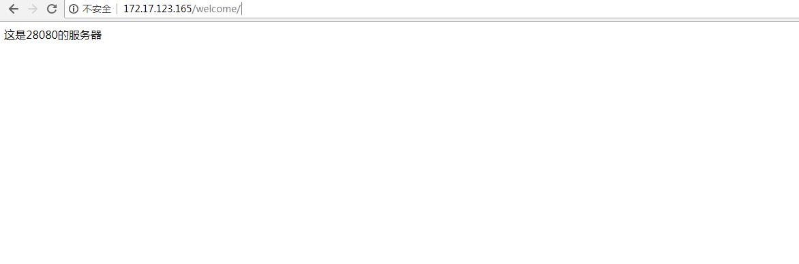
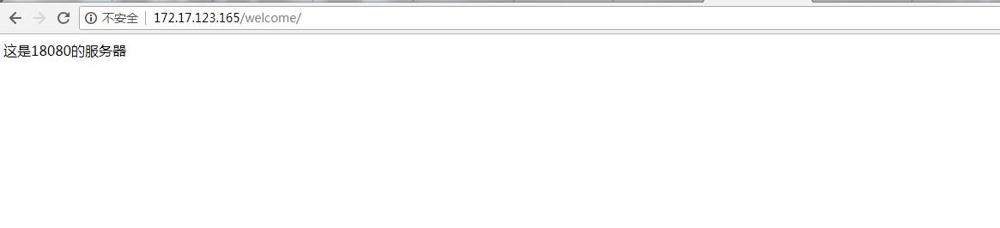

# nginx与tomcat集群部署方案说明
## 文件需要修改的部分
```
    upstream testnginx { #服务器集群名   
    server 172.17.123.165:18080 weight=1;   
    server 172.17.123.165:28080 weight=1; }  
```
- 简单测试：将`172.17.123.165`改为本地的ipv4地址。
- 上服务器时将`172.17.123.165:18080`与`172.17.123.165:28080` 改为对应应用的IP和端口号。
- 如需进行负载均衡的权重配置，修改`weight`参数。
## 检查是否部署成功
> 在windows下nginx存在命令无法关闭服务的问题，请在任务管理器中关闭nginx服务器再重新启动

*简单测试*
1. 在tomcat启动两个不同的tomcat服务器
2. 启动nginx服务器
3. 在浏览器中输入`http://172.17.123.165/welcome` 查看显示结果<br>

4. 刷新页面，查看显示结果<br>
