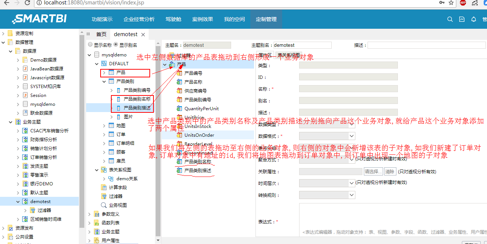
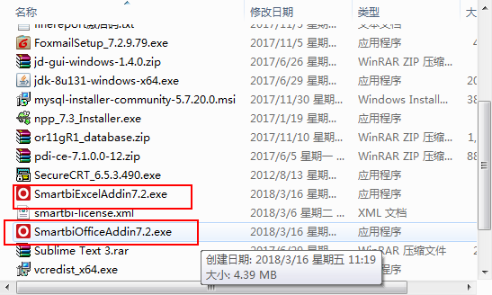

## SMARTBI使用

#### 安装
**系统环境要求**
1. 环境:windows下64位操作系统
2. windows下安装(知识库为mysql服务器,可在安装过程中注册为系统服务,在开始菜单中将多一个后台控制器)
3. 插件安装,下载插件点击安装即可,office插件支持office2010/2013/2016

**安装过程**
1. 官网下载安装包(推荐使用百度云下载,可以找到插件及历史版本*link*:[下载链接](https://pan.baidu.com/s/1skBn4Hv#list/path=%2F))
2. 点击安装    

3. 注意项: 安装过程直接下一步即可,输入公司名等信息随意,无限制,检查知识库端口(其实是检查mysql端口)通过后点击下一步,可以点击注册为windows服务,将会生成后台服务管理器,点击安装

#### 启动
1. 在开始菜单中找到`smartbi Insight` 进入目录点击启动应用服务器(实际是执行tomcat的startup.bat批处理文件),进行启动.
2. 等待执行完成后,点击访问`smartbi`,弹出添加授权文件的页面,这里我们先与客服沟通并获取到了对应的零时licence:`smartbi-license.xml`将其依照提示添加或直接将文件添加到tomcat的bin目录下
3. 添加licence后,再次进行访问,我们就进入了smartbi的登录界面,初次登录admin使用的是默认密码`manager`,进入后提示我们修改密码    

> 系统界面

#### 自助分析
既然是bi产品,那就是面向业务人员的产品,业务人员分析时如何使用产品就是该部分的内容
1. **创建关系数据源**,我们的数据大都是基于数据库的,而进行自助分析的前提是搭建好数据模型,数据模型的搭建首先需要让我们的应用知道从哪儿取数,所以第一步是创建关系数据源    
    
填写驱动信息及数据库信息,测试连接并保存    
      
管理数据库中的数据内容及关系    
     
添加需要构建关系管理的表    
    
查看添加的表,进行表的注释,便于表关系视图的梳理    
    
    
新建表关系视图,保存表与表间关系    
    
建立表关系视图    
    

2. **创建业务主题**    
业务主题是为了在对应的业务逻辑中添加所需用到的由表抽象出来的对象所创建的集合
反手键点击数据管理下的业务主题,弹出菜单点击新建,我们就可以进行新建业务主题    
     
新建业务主题后我们将在业务主题下看到我们新建的业务主题,双击打开编辑    
    
对业务对象属性的修改    
    
对业务对象对象属性的增加    
    
对业务对象对象属性的属性的增加及修改     
   
   
3. **创建组合分析**    
建立好业务主题后,我们就可以基于业务主题进行分析(也可以基于数据源进行主题分析,很不灵活)     
组合分析是清单式的,一行表头罗列数据的,通过组合各种列进行展示
    
    
进行组合分析    
     
效果
    
添加图型

4. **创建透视分析**    
以上组合分析主要是用于查询数据结果,相对固定,无法上钻下钻,接下来的透视分析则与之不同,可以用于交叉报表并可进行数据间的穿透    
    
步骤与组合分析类似    
    
添加小计    
    
添加筛选条件    
    

5. **保存**
    

#### 电子表格
电子表格是使用excel插件进行表单的定制化开发,有点类似于帆软的设计器    
1. **下载excel的smartbi插件**    
通过百度云盘即可下得如下插件,我们将使用excel插件来进行电子表格的开发    
    
2. **安装**    
运行.exe文件直接下一步就可以
3. **启动excel配置环境**

4. **数据源配置**    
同自助分析
5. **表关系定义**    
同自助分析
6. **创建业务查询**    
由于我们是通过excel进行表单的开发,故我们需要对表间关系进行业务关联,而创建业务查询就是为了这一目标而存在的,我试验过不进行创建直接使用多表,最后出现了笛卡尔积问题    
    
业务查询
    
通过以上操作我们就可以开始excel的定制开发了    
7. **excel开发**    
我们现在回到excel,并登录到smartbi的服务器,在右侧的数据集面版中找到我们定义好的业务查询(如果没有找到数据集面板,请点击左上角服务器区块的视图)    
    
样式及单元格填充    
     
预览效果    
    
执行效果
    

