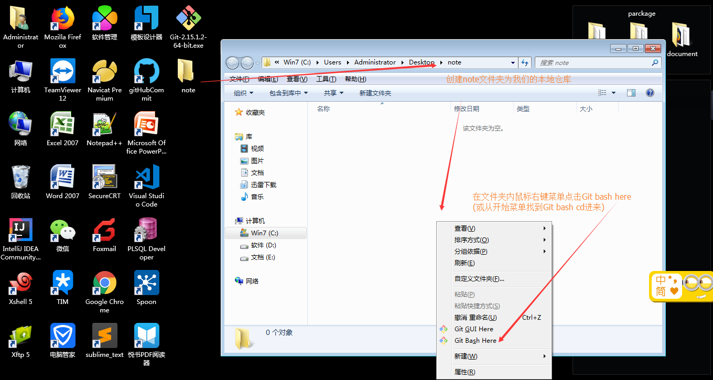

## 使用**GitHub**对笔记进行管理的步骤
#### **GitHub**及**码云**到底是什么??
我们这里使用到的两个网站,一个[GitHub](https://github.com/),一个[码云](https://gitee.com/),其实都是提供代码托管服务的网站,就是一个大家都能使用的公开的版本控制器.    
> 什么是版本控制器:能对我们在编写代码时进行的各项更改进行记录的工具,目前我使用过的有两种,一种是`SVN`,一种则是我们即将使用到的`Git`,`SVN`是一个中央版本控制器,即我们所有的更改都需要提交到一个中央库中,才能使该版本生效,而`Git`则是一款分布式的版本控制器,每个参与项目或者文件修改的人都拥有一套完整的库,在这里我们由于使用`git`来对笔记进行管理,所以不需要太多的相关知识即可创建自己的笔记库.
#### 使用**GitHub**对笔记进行管理的步骤:
1. 使用**GitHub**或者码云的前提是拥有**GitHub**的账户,首先登录[GitHub](https://github.com/)或者[码云](https://gitee.com/),在这里我用**GitHub**进行实例演示(**addition**:*当拥有GitHub时,码云可通过GitHub的账户获取到你的库及库中的全部内容,码云由于是国内的托管服务,相较GitHub可能速度会更快一些.*)
    - 注册账户:该填邮箱填邮箱,该填密码填密码.
    
    - step2:点击continue即可.
    
    - 登录注册时使用的邮箱对邮箱进行验证
    
    > 现在我们就拥有了一个GitHub的账户,可以用来托管我们的笔记

2. 当我们拥有了GitHub的账户后,我们可以先创建一个远程的仓库.(addition:之后可以通过`git clone`克隆仓库到本地或者`git remote`去用本地链接远程仓库)
    - 创建仓库:clink`start a project`
    
    - 填写仓库名称添加仓库
    
    - 仓库介绍
    

3. 安装`git`
    - 下载[git的安装包](https://git-scm.com/download)
    
    - 安装,之前已经安装过了,这里傻瓜式一直下一步就好.    
    
    > 现在我们拥有了github账户及仓库,本地也拥有了git环境,现在我们就可以使用git来进行笔记的托管了

4. 使用`git`
    - 使用`git bash` :
    
    > 事实上`git bash`就是完全模拟Linux的命令行而已,我们的git命令完全可以在windows的cmd下运行,原因是因为我们在安装git的时候已经将其当成环境变量配置进我们的path之中了,有兴趣的可以去对此进行测试.

    - `git`的命令 :
    git的基础命令也没有多少也很容易学习,这里我们就使用这些基础命令(addition:冲突解决等我们在共同开发时是需要的,有兴趣就可以去进行更为深入的学习)
        + 首先查看我们是不是正确安装了git    
        `git -version`
        ```shell
        Administrator@PC-ThinkPadT430 MINGW64 ~/Desktop/note
        $ git --version
        git version 2.15.0.windows.1
        ```
        + 开始对git进行全局配置 :配置就是配置当前的使用者是谁,用来记录是谁修改的操作.全局就是对本机的所有仓库进行设置,之后再有别的仓库也不需要另外做配置.    
        `git config --global user.name "Your Name"`    
        `git config --global user.email "email@example.com"`
        ```shell
        Administrator@PC-ThinkPadT430 MINGW64 ~/Desktop/note
        $ git config --global user.name "CharlesCloud"
        Administrator@PC-ThinkPadT430 MINGW64 ~/Desktop/note
        $ git config --global user.email "gocloud@yeah.net"
        ```  
        + 生成git仓库    
        `git init`:说明:我们要用那个目录建立仓库请先cd到那个目录下.
        ```shell
        Administrator@PC-ThinkPadT430 MINGW64 ~/Desktop/note
        $ git init
        Initialized empty Git repository in C:/Users/Administrator/Desktop/note/.git/
        Administrator@PC-ThinkPadT430 MINGW64 ~/Desktop/note (master)
        ```
        > 在此步骤后,我们将在note目录下找到一个隐藏的文件夹`.git`,我们的版本控制的信息就在这个文件夹中,至此,我们创建了一个本地的git仓库
        + 我们在本地目录中现在可以创建文件及文件夹,并使用git命令对文件进行提交git仓库等操作.
        > 在此创建`README.MD`文件进行操作,可以通过编辑器编辑也可使用命令行编辑该文件.    

        |git基础命令|作用|
        |:--|:--|
        |`git status `|当前仓库的文件状态,比如什么文件你创建了还没被添加，什么文件你添加了还没提交。|
        |`git add `+文件名| 添加文件到仓库|
        |git commit -m "your commit message"|提交改动,信息在我们开发的时候一定要加上,但做笔记的话可以选择性的加|
        > git最重要的作用是版本控制,如版本的回退,文件diff等,用来给工程上保险,买后悔药的,有兴趣去查看其相关命令,我们这里只要正常能提交我们的note即可,对版本的要求没有那么重要.

        ```shell
        Administrator@PC-ThinkPadT430 MINGW64 ~/Desktop/note (master)
        $ vim README.MD
        Administrator@PC-ThinkPadT430 MINGW64 ~/Desktop/note (master)
        $ git add README.MD
        warning: LF will be replaced by CRLF in README.MD.
        The file will have its original line endings in your working directory.
        Administrator@PC-ThinkPadT430 MINGW64 ~/Desktop/note (master)
        $ git status
        On branch master
        No commits yet
        Changes to be committed:
          (use "git rm --cached <file>..." to unstage)
                new file:   README.MD
        Administrator@PC-ThinkPadT430 MINGW64 ~/Desktop/note (master)
        $ git commit -m "a test file"
        [master (root-commit) ff6fc52] a test file
         1 file changed, 3 insertions(+)
         create mode 100644 README.MD
        Administrator@PC-ThinkPadT430 MINGW64 ~/Desktop/note (master)
        $ git status
        On branch master
        nothing to commit, working tree clean
        ```
        + 我们现在已经拥有了一个git托管下的自己的文件库,现在我们需要把自己的本地库与远程库相连,第一步我们需要在我们的windows下创建sshKey    
        使用`$ ssh-keygen -t rsa -C "youremail@example.com"`命令 然后按三次enter(不需要密码啥的)
        ```
        Administrator@PC-ThinkPadT430 MINGW64 ~/Desktop/note (master)
        $ ssh-keygen -t rsa -C "gocloud@yeah.net"
        Generating public/private rsa key pair.
        Enter file in which to save the key (/c/Users/Administrator/.ssh/id_rsa):
        Created directory '/c/Users/Administrator/.ssh'.
        Enter passphrase (empty for no passphrase):
        Enter same passphrase again:
        Your identification has been saved in /c/Users/Administrator/.ssh/id_rsa.
        Your public key has been saved in /c/Users/Administrator/.ssh/id_rsa.pub.
        The key fingerprint is:
        SHA256:Omf5mT7a6OjcivcSCQ4PLuFkfoo7SjCSE2h+YB/zjVI gocloud@yeah.net
        The key's randomart image is:
        +---[RSA 2048]----+
        |                 |
        |.                |
        |o+ o E           |
        |=== * o          |
        |@+ O + oS        |
        |+=o.+ o. .       |
        |.oo   o.+        |
        |+.   oo* +.o     |
        |+o  .o==*o*.     |
        +----[SHA256]-----+
        Administrator@PC-ThinkPadT430 MINGW64 ~/Desktop/note (master)
        ```
        + 然后你会在当前用户的目录下(就是C:/user下的你当前登录的用户目录)看到一个.ssh文件夹,这个文件夹里的两个文件就是我们生成的ssh公钥和秘钥,公钥是有pub那个文件(public),我们打开公钥文件,将其中的文本复制到[github的sshkey的配置位置](https://github.com/settings/keys)
        
        添加ssh公钥
        
        + 现在我们的设备就有了去到github的钥匙,那我们就可以将本地的仓库与远程仓库进行连接.
        `$ git remote add <shortname> <url> `
        shortname就是我们本地对远程的命名,在这里我命名为`origin`,url则是我们远程仓库的`ssh`连接
        获取`url`
        
        ```shell     
        Administrator@PC-ThinkPadT430 MINGW64 ~/Desktop/note (master)
        $ git remote add origin git@github.com:CharlesCloud/note.git
        
        Administrator@PC-ThinkPadT430 MINGW64 ~/Desktop/note (master)
        $ git remote
        origin
        ``` 
        + 我们现在就可以使用`git push`命令将本地的更改提交向远程    
        git push 远端名称 分支名称(默认分支就是master)
        ```shell
        Administrator@PC-ThinkPadT430 MINGW64 ~/Desktop/note (master)
        $ git push origin master
        The authenticity of host 'github.com (192.30.255.112)' can't be established.
        RSA key fingerprint is SHA256:nThbg6kXUpJWGl7E1IGOCspRomTxdCARLviKw6E5SY8.
        Are you sure you want to continue connecting (yes/no)? y
        Please type 'yes' or 'no': yes
        Warning: Permanently added 'github.com,192.30.255.112' (RSA) to the list of known         hosts.
        Counting objects: 3, done.
        Delta compression using up to 4 threads.
        Compressing objects: 100% (2/2), done.
        Writing objects: 100% (3/3), 410 bytes | 205.00 KiB/s, done.
        Total 3 (delta 0), reused 0 (delta 0)
        To github.com:CharlesCloud/note.git
         * [new branch]      master -> master

        ```
        + 现在我们去检查我们的远端仓库就会发现远端仓库和我们的本地仓库同步了
        

#### **终极重点**:
大家也看到了,通过这样的方式去管理笔记并没有啥效率,反而各种git命令导致很没有效率,我之前说过,在安装了git之后,我们就在系统的环境变量中配置了git,那也就是说我们可以通过windows的批处理命令去对git进行操作,使管理笔记更为方便和快捷:
1. 首先我们创建一个`commitnote.bat`的批处理文件,随意位置(建议不要放在桌面,通过快捷方式添加自己喜欢的icon显得更高大上点),然后用编辑器打开添加以下内容并保存.
```shell
rem 这里是我们本地库的路径
cd C:\Users\Administrator\Desktop\note
rem 这是将远程的更改更新到本地
git pull origin master
rem 这是添加所有,也可以用*
git add .
rem 这里是提交,message随意
git commit -m "unknown change"
rem 将本地修改同步至远程
git push origin master
```
2. 随意在我们的本地库里做修改然后点击该批处理文件或他的快捷方式,我们就会将我们的笔记提交到远端,任何时候都可以进行翻看,(极其适合使用markdowm来进行笔记,排版优秀)
点击批处理文件如下效果    

查看远端效果如下

> 使用说明:可以将你笔记日志等文件放置于自己的仓库内,只需点击批处理文件,完成拉取->添加文件->提交->同步至远端的操作,为了有个好看的图标,我使用快捷方式加icon,变成下图中的样子    


