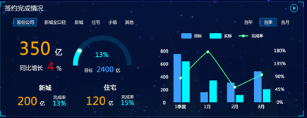
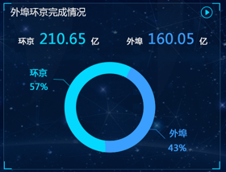

# 财务取数逻辑
> 2018-06-01 财务取数逻辑确认
## 签约
### 维度确认
- **签约完成情况**

    
- 值    

    值名称|例子|说明|值取值数据表|值取值字段
    :--:|:--|:--|:--|:--
    实际 |`350亿`|||
    目标 |`2400亿`|||
    同比增长|`4%`|是否直取,是否需要取到同比日期结果进行对比||
- 维度

    维度名称|例子|说明|维度取值数据表|维度取值
    :--:|:--|:--|:--|:--
    组织架构|`股份公司`|||
    类型|`新城`|||
    期间|`当年`|是否直取,逻辑上否需要汇总||
- 钻取取数说明


- **季度预估**

    
- 值    

    值名称|例子|说明|值取值数据表|值取值字段
    :--:|:--|:--|:--|:--
    实际 |`10亿`|||
    目标 |`5亿`|||
    预估完成|`5亿`|||
    预估完成率|`50%`|是否直取,否则计算方式为什么||

    > **tips:** <br>question: 新城 住宅等是否也是与股份公司在一个维度???
- 钻取取数说明
    ```
    ```


- **外埠环京完成情况**

    
- 维度
    外埠环京是取那个数据表的那个字段
- 钻取取数说明
    ```
    ```
- **排名**

    
- 值    
    值名称|例子|说明|值取值数据表|值取值字段
    :--:|:--|:--|:--|:--
    实际 |`10亿`|||
    完成率 |`5亿`|||
- 钻取取数说明
    ```
    ```

## 回款
> 同签约
- 补充内容
```
```

## 产服收入
> 大体同签约,精简为如下逻辑需求
- 维度确认
    1. 无形资产
    2. 固定资产
- 产服收入转化率

    
    - 维度确认
    维度名称|例子|说明|维度取值数据表|维度取值
    :--:|:--|:--|:--|:--
    ???|`累计管理口径产服收入`|这个维度是什么,通过什么字段区分,转化率如何计算||
    是否结算|`30亿`|||
    - 钻取取数说明
    ```
    ```


## 净现金流
- 维度确认
    1. 区域
    2. 年度现金流目标
    3. 累计完成
    4. 与目标差异
    5. 本季度目标
    6. 季度累计完成
    7. 与目标差异(`tips: 这个应该是季度的差异了吧,从2到6是在一个指标中还是自己独立为指标,如果没有计算方式如何`)
- 钻取说明
```
```


## 应收账款

    

    - 维度确认

    
    

## 存货
- 取数表
```
```

## 实际缴纳税金
- 取数表
```
```